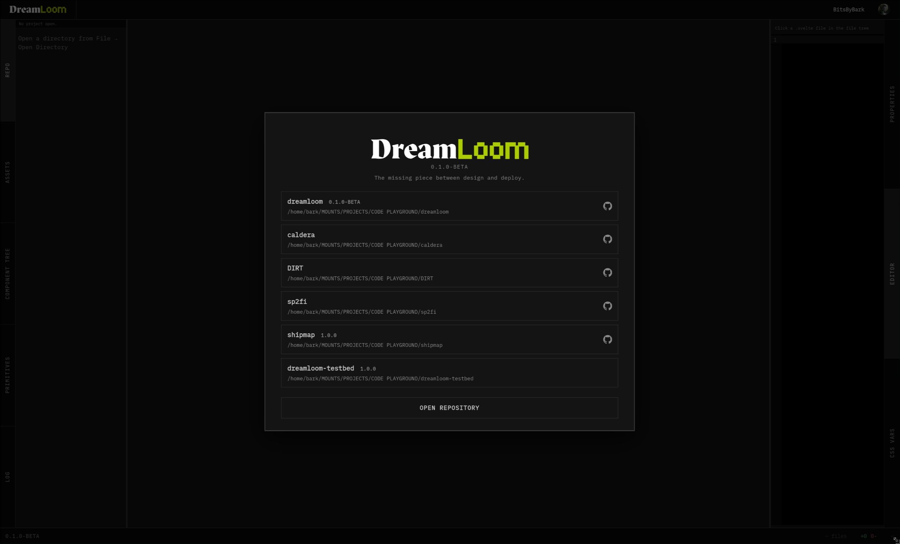

<p align="center">
  
</p>

<p align="center"><strong>Frontend and backend, finally on the same page.</strong></p>

<p align="center">
  
  
  
</p>

DreamLoom is a desktop visual editor for real Svelte projects. Click an element in the live preview, tweak its styles, and DreamLoom writes the code back into your repo instead of trapping it in some fake design file. It exists because the design-to-code handoff is cooked, and editing CSS blind is somehow still normal.

<p align="center">
  
</p>

## Features

- Live project preview powered by your local dev server
- Click-to-select elements from the preview
- Read-only CodeMirror source view with selection highlighting
- Visual controls for layout, spacing, size, type, background, and borders
- CSS writes back into Svelte style blocks
- `dl-*` class injection for elements that need editable hooks
- Named class extraction into `dreamloom.css`
- CSS variable editor for `:root` variables in `dreamloom.css`
- Repo/file tree, component tree, assets panel, and primitive insertion
- GitHub device login with profile display
- Git status bar, commit modal, staging, `.gitignore` editing, commit, and push
- Configurable settings for zoom, tab eviction, undo depth, status bar, and window chrome
- Ctrl/Cmd+Z undo for property edits
- RPM packaging for Linux beta builds

## Roadmap
## Roadmap

**v0.1.0-beta — done**  
Core loop. Click → edit → write. Personal use only.

**v0.2.0 — Effects**  
Complete the properties panel. Box-shadow, opacity, transform, filter, backdrop-filter, transitions, animations.

**v0.3.0 — Polish**  
Feels like a real shipped product. Micro-interactions, CSS class nesting, responsive breakpoints, editor write mode.

**v1.0.0 — Launch**  
Public. Open core. Free for individuals, enterprise pays. Installers for Linux, macOS, Windows. Docs site.

**v1.1.0 — Static**  
Vanilla HTML + CSS support. No framework required.

**v1.2.0 — React**  
React support via CSS modules injector strategy.

**v1.3.0 — Vue**  
Vue support via scoped style block injector. Community injector API — bring your own framework.

## Built with

- Tauri v2
- Svelte
- Rust
- CodeMirror

## Getting started

```bash
git clone https://github.com/BitsByBark/dreamloom.git
cd dreamloom
pnpm install
pnpm tauri dev
```

## Beta builds

Grab builds from GitHub Actions artifacts:

1. Open https://github.com/BitsByBark/dreamloom/actions
2. Open the newest green `build artifacts` run.
3. Download the artifact for your system.
4. Unzip it and install/run the build.

Fedora:

```bash
unzip dreamloom-fedora-rpm.zip
sudo dnf install ./dreamloom-*.rpm
dreamloom
```

Arch:

```bash
unzip dreamloom-arch-portable.zip
tar -xzf dreamloom-arch-x86_64.tar.gz
chmod +x dreamloom
./dreamloom
```

Windows 11:

```text
Download dreamloom-windows11.zip, unzip it, then run the .msi or .exe installer inside.
```

macOS:

```text
Download dreamloom-macos.zip, unzip it, then open the .dmg or .app inside.
```

Unsigned macOS builds may get blocked by Gatekeeper. If you trust the artifact, remove quarantine:

```bash
xattr -dr com.apple.quarantine DreamLoom.app
```

## Community

- Discord: https://discord.gg/Ec7pyQnbP4
- GitHub: https://github.com/BitsByBark/dreamloom

<p align="center">
  Made by <a href="https://madebybark.com">BARK</a>
</p>
